# Hi, everyone! 👋

I'm **Nicodemus Lin**, a Senior Mobile Engineer with 8+ years of experience building and scaling mobile applications from concept to production, including products reaching over 1 million downloads. I care deeply about clean architecture, CI/CD automation, and technical leadership to ship reliable, high-performing products.

Find my personal portfolio [here](https://nicolin.dev) or connect with me on [LinkedIn](https://www.linkedin.com/in/nicodemus-lin/).

---

## Tech Experiences

---

## Featured Open Source Project

### [Flutter Enterprise Starter Kit](https://github.com/nicolinx)
A production-ready Flutter starter kit demonstrating Clean Architecture, Cubit, dependency injection, Firebase, CI/CD, and modern engineering best practices.
- **Architecture:** Clean Architecture + Cubit / BLoC
- **Features:** Offline caching, GitHub Actions CI/CD, feature-based modular structure
- **Testing:** Automated testing setups & Mockito patterns

---

## GitHub Overview

  

    
    
  

  

    
  

---

## My GitHub Contributions

  <picture>
    <source media="(prefers-color-scheme: dark)" srcset="https://raw.githubusercontent.com/nicolinx/nicolinx/output/github-contribution-grid-snake-dark.svg">
    <source media="(prefers-color-scheme: light)" srcset="https://raw.githubusercontent.com/nicolinx/nicolinx/output/github-contribution-grid-snake.svg">
    
  </picture>

---

© 2026 — [Nicodemus Lin](https://nicolin.dev)
